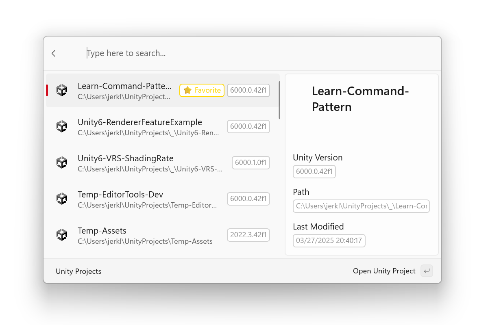

# Command Palette (CmdPal) Unity Extension

## Overview
This project provide a [Command Palette](https://learn.microsoft.com/en-us/windows/powertoys/command-palette/overview) extension for opening Unity Hub recent projects.



## Installation

### Requirements
- [PowerToys](https://learn.microsoft.com/en-us/windows/powertoys/) installed, with Command Palette module enabled
- Unity Hub installed, with recent projects history
> Unity Hub is not required to run in the background, as this extension launches editor directly.

[//]: # (* Windows 11)

### WinGet [Recommended]

[//]: # (`winget install maoyeedy.UnityForCmdPal`)
In Progress.

### Microsoft Store

In Progress.

### Via GitHub

Released builds can be manually downloaded from this repository's [Releases page](https://github.com/maoyeedy/CmdPalUnityExtension/releases).

[//]: # (## Settings)

## Development

### Parsing Recent Projects
```powershell
# Beautify the history json
jq . "$HOME/AppData/Roaming/UnityHub/projects-v1.json"

# List most recent 3 projects:
jq '.data | to_entries | .[-3:] | from_entries' "$HOME/AppData/Roaming/UnityHub/projects-v1.json"
```

### Parsing Installed Editors
```powershell
Get-ChildItem -Path "HKLM:\SOFTWARE\Unity Technologies\Installer\", "HKCU:\SOFTWARE\Unity Technologies\Installer\"
```

[//]: # (### Launch project bypassing UnityHub)
[//]: # (```)
[//]: # (& "C:\Program Files\Unity\Hub\Editor\$Version\Editor\Unity.exe" -projectPath $Path)
[//]: # (```)

## Contributing
If you have bug reports or feature requests, any issues are welcome.

If you want to contribute, submit pull request directly to `master`.

## TODO
- [x] Expose settings to sort and filter the list output.
- [ ] Add fallback dialog if editor for a project is not installed.
- [ ] Option to open project with another Unity version.
- [ ] Add sub-command to view all installed Unity versions and their paths.
- [ ] Overwrite timestamp in unityhub json.

## Related Repositories

1. [PowerToys Command Palette Utility](https://github.com/microsoft/PowerToys/tree/main/src/modules/cmdpal)  
   Core runtime that this extension builds upon.

2. [Unity3D Project Lister and Launcher](https://github.com/falldeaf/unity-flowlauncher)  
   Inspiration for creating this plugin, but I'll avoid its dependency on [Unity Setup Powershell Module](https://github.com/microsoft/unitysetup.powershell).
