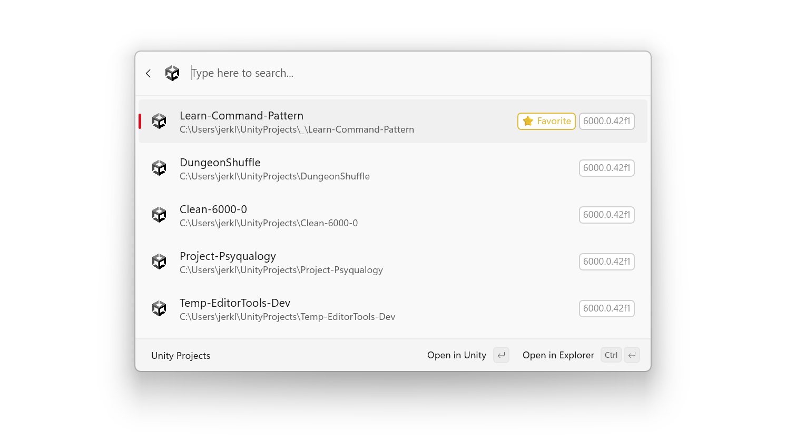

# Command Palette (CmdPal) Unity Extension

## Overview
This project provide a [Command Palette](https://learn.microsoft.com/en-us/windows/powertoys/command-palette/overview) extension for opening Unity Hub recent projects.



## Installation

### Requirements
The Command Palette Unity Extension requires:
* [PowerToys](https://learn.microsoft.com/en-us/windows/powertoys/) with Command Palette included
* Windows 11
* An ARM64 or x64 processor

### WinGet [Recommended]

`winget install maoyeedy.UnityForCmdPal`

### Microsoft Store

In Progress.

### Via GitHub

Released builds can be manually downloaded from this repository's [Releases page](https://github.com/maoyeedy/CmdPalUnityExtension/releases).

[//]: # (## Settings)

## Development

### Parsing UnityHub History
Beautify the history json with `jq`:
```
cat ~/AppData/Roaming/UnityHub/projects-v1.json | jq
```
List most recent 3 projects:
```
cat ~/AppData/Roaming/UnityHub/projects-v1.json | jq '.data | to_entries | .[-3:] | from_entries'
```

### Launch project bypassing UnityHub
```
& "C:\Program Files\Unity\Hub\Editor\$Version\Editor\Unity.exe" -projectPath $Path
```

## Contributing
If you have bug reports or feature requests, any issues are welcome.

If you want to contribute, submit pull request directly to `master`.

## TODO
- [ ] Expose settings to sort and filter the list output.
- [ ] Expose settings to customize details panel.
- [ ] Expose command to list all installed Unity versions and their paths.
- [ ] Option to open project with another installed Unity version.

## Related Repositories

1. [PowerToys Command Palette Utility](https://github.com/microsoft/PowerToys/tree/main/src/modules/cmdpal)  
   Core runtime that this extension builds upon.

2. [Unity3D Project Lister and Launcher](https://github.com/falldeaf/unity-flowlauncher)  
   Inspiration for creating this plugin, but I'll avoid its dependency on [Unity Setup Powershell Module](https://github.com/microsoft/unitysetup.powershell).